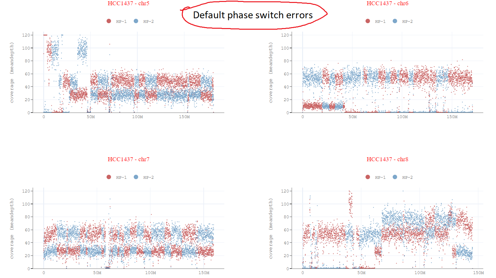

# hapcorrect

###### Note: This repository is under extensive updates.

hapcorrect takes long-read alignment and phased heterozygous variants as input, and corrects the haplotypes phase-switching errors in BAMs around phased blocks as well as inside phase-blocks.


#### Phasing errors:


#### Phasing errors correction:


## Usage 

### Tumor-Normal Mode (requires normal phased VCF)
```
python main.py --threads <4> --reference <ref.fa>  --target-bam <data.tumor.bam>  --tumor-vcf <data.tumor.vcf.gz>  --normal-phased-vcf <data.normal_phased.vcf.gz>  --unphased-reads-coverage-enable True --phaseblock-flipping-enable True  --genome-name <cellline/dataset name> --cut-threshold <150> --out-dir-plots <genome_abc_output>
```
## Optional parameters
* `--rephase-normal-vcf` Set true to rephase normal VCF with hapcorrect phasing correction (default: disabled)
* `--rehaplotag-tumor-bam` Set true to rehaplotag the tumor BAM with new rephased VCF from above step (default: disabled)


### Tumor-only (requires tumor phased/haplotagged BAM and phased VCF)
```
python main.py --threads <4> --reference <ref.fa>  --target-bam <data.tumor_haplotagged.bam>  --tumor-vcf <data.tumor_phased.vcf.gz>  --unphased-reads-coverage-enable True --phaseblock-flipping-enable True  --genome-name <cellline/dataset name> --cut-threshold <150> --out-dir-plots <genome_abc_output>
```
## Optional parameters
* `--rephase-tumor-vcf` Set true to rephase tumor VCF with hapcorrect phasing correction (default: disabled)